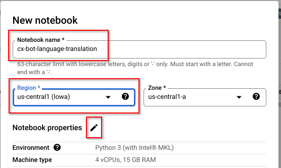
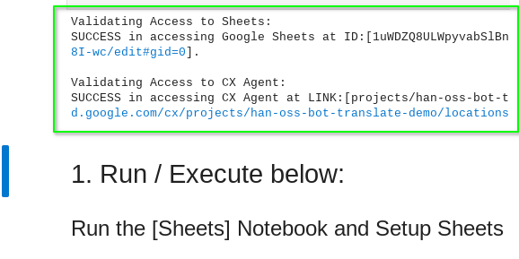
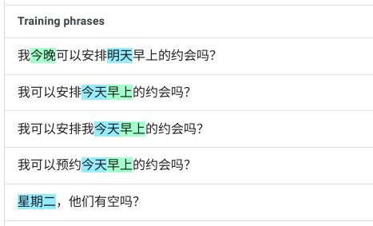

# Dialogflow CX Bot Language Translation (dialogflow-cx-bot-language-translation)
**This is not an officially supported Google product**

## Table of Content:
- [Problem Statement](#problem_statement)
- [Solution](#solution)
- [Getting Started](#getting_started)
- [Setup & Demo Walkthrough (soup to nuts)](#walkthrough)

## Problem Statement 

- You have an existing Dialogflow CX Agent/Bot in one language and would like to quickly have this same instance support secondary language/s 

- While Dialogflow CX can quickly duplicate your conversation flow and design to a supported secondary language, you have to provide the equivalent training phrases, entity type synonyms and bot responses for the secondary language/s.  Thus, adding a new language to a fully developed agent/bot can take time, specifically in these areas:
    - Intents training phrases
    - Entity Types synonyms
    - Bot responses in:
        - Flows
        - Pages
        - Transition Routes
        - Event Handlers and
        - Transition Route Groups

- You would like to automate and leverage **Google Cloud Translate API** to bulk translate from your default language to the supported secondary language/s to **jumpstart the process**.  This will reduce the initial load of linguists/analysts in language translation and allow them to focus on reviewing and correcting the translated output. 

## Solution 
The Jupyter Notebooks in this repository uses the following APIs:
- Dialogflow CX v3beta1 API
- Google Sheets (v4) API
- Google Cloud Translate v3beta1 API

The Jupyter Notebooks (Python) performs the following:
- Query your Dialogflow CX Agent/Bot
- Populate your Google Sheets with values that require translation from the default language
- Use Google Cloud Translate for bulk translation and output to Google Sheets
- Update your Dialogflow CX Agent/Bot with translations from Google Sheets

Each sequential step above is within your control as you execute different cells within the Jupyter Notebook. 

---------

## Getting Started 

**Assumption**: You have a working Dialogflow CX Agent/Bot.

**Implication**: You have a working: 
- Google Cloud Project with Billing enabled
- Google Account with Owner/Editor access

### 1.  Create a new and empty Google Sheets
- https://sheets.google.com OR enter **sheets.new** in your browser
- Suggested naming convention (optional - for human readability):  *"CX Bot - [Name] - Multilingual Config"*
- **Note** the Sheets Link/URL.  Example: `https://docs.google.com/spreadsheets/d/<Your Sheets ID HERE>/edit#gid=0`
  - you will need to provide this in the Jupyter Notebook later.

### 2.  Dialogflow CX Bot Settings
- In your CX Agent instance, add the secondary language/s in the [Agent Settings | Languages] section.  This will enable the code to determine which languages to translate from your default language.
  

- **Note** your CX Agent Link (see screenshot below on how to get it)
  - you will need to provide this in the Jupyter Notebook later.
  

### 3.  Enable Google Cloud Translate API
- Enable Google Cloud Translate API in your [Google Cloud Console](https://console.cloud.google.com)
  - Menu - APIs and services - Library OR https://console.cloud.google.com/apis/library
  - Search for **"Cloud Translate"** and **enable** the Cloud Translation API
- Note the **Google Cloud Project ID** where you have enabled Cloud Translation API
  - The easiest path is to enable the Cloud Translation API in the same Google Cloud Project as your Dialogflow Agent
  - It is not mandatory as you may have another Project with Translation API enabled and billing setup
  - you will need to provide the **GCP Project ID** for the enabled Cloud Translation API in the Jupyter Notebook later.

### 4.  Setup your Jupyter Notebook environment
- Basic Jupyter Notebook install - see https://jupyter.org/install
- Additional packages to install (`pip or pip3 install --upgrade`):
    - Google Sheets: `google-api-python-client google-auth-httplib2 google-auth-oauthlib`
    - Dialogflow CX: `google-cloud-dialogflow-cx`
    - Google Cloud Translate: `google-cloud-translate`
    - Pandas: `pandas`
    - BeautifulSoup: `beautifulsoup4`
- From Jupyter Notebook, open **CX-Bot-Translate__MAIN.ipynb** and follow along, entering the values noted above in steps 1 through 3.

If you are familiar with Jupyter Notebooks, Python and Google Cloud Platform, you should be **good to go** from this point.  We would still highlight reading the section below on Google Cloud [**Authentication & Authorization**](#AA) options.  As Jupyter Notebooks can be executed from a variety of environments, from local compute to online platforms, your mileage may vary as you balance ease of deployment and potential security exposure.

For a more detailed walkthrough, from setup to translating your first Dialogflow CX bot, all actionable from your web browser with resources deployed in Google Cloud Platform, please see the longer [Setup & Demo Walkthrough](#walkthrough) section below.

### Special Note on Authentication & Authorization 
- Accessing Google Cloud APIs and Services requires Authentication and Authorization
- It is very common to see the use of Services Accounts and Service Account Keys (in JSON files) for programs to act on your behalf
- The code in this repository is flexible enough to support Service Accounts and Service Account Keys **but...** 
    - before you go ahead and create Service Accounts and Keys, consider this excellent blog [Choose the best way to use and authenticate service accounts on Google Cloud](https://cloud.google.com/blog/products/identity-security/how-to-authenticate-service-accounts-to-help-keep-applications-secure)
    
    - For Google Cloud services (eg Dialogflow, Cloud Translate etc), consider downloading [Google Cloud SDK](https://cloud.google.com/sdk/docs/quickstart).  With [Google Cloud SDK](https://cloud.google.com/sdk/docs/quickstart), you can setup OAuth locally with your credentials without the use of Service Accounts.  Running the Jupyter Notebooks will automatically inherit the OAuth already setup on the system via Google Cloud SDK.

    - For Google Sheets, consider creating an OAuth credentials instead of Service Accounts.  Details can be found:
      - [Python Quickstart for Sheets API](https://developers.google.com/sheets/api/quickstart/python)
      - [Create access credentials](https://developers.google.com/workspace/guides/create-credentials)

---------

## Setup & Demo Walkthrough (soup to nuts) 

This walkthrough focuses on **ease of getting started** and will use resources in **Google Cloud Platform**, which means you will only need a laptop/PC/Mac with a web browser to get up and running.

There are 9 steps in this walkthrough.

Steps 1 through 7 are for setting up the Demo.  This is a "soup to nuts" walkthrough.

In Step 8, we walkthrough the sequential execution of the Notebook, with language translation and updates to the design-side of Dialogflow CX Healthcare Bot.

In Step 9, we illustrate the testing of the Dialogflow CX Healthcare bot.

### Walkthrough Steps:
1. [Create a Google Cloud Project](#gcp_project)
1. [Create a Dialogflow CX agent from pre-built agent template](#dfcx_pba)
1. [Enable Cloud Translate API](#cloud_translate_api)
1. [Enable Google Sheets API](#gsheets_api)
1. [Create a Vertex Workbench](#vertex_workbench)
1. [Clone this repo into the Notebook](#clone_repo)
1. [One-time Setup in the **`CX-Bot-Translate__MAIN.ipynb`** notebook](#notebook_config)
1. [Running **`CX-Bot-Translate__MAIN.ipynb`** notebook](#notebook_execute)
1. [Testing the Healthcare Agent in the new languages](#test_chat)

---------

### 1. Create a Google Cloud Project 

1. Create a new Google Cloud Project and for free* via https://cloud.google.com/free with $300 in free credits (offer as at the time of this writing)

   *free\** - eligibility details at https://cloud.google.com/free/docs/gcp-free-tier/#free-trial

1. Name your project as desired.  More importantly, note the project's ID.  This is a unique identifier globally for your GCP project.  

   It is important to ensure you are in the right GCP project when executing your setup via the Cloud Console.  You can verify this by looking at the top-left of the Cloud Console (screenshot below)
   

1. From your [Cloud Console](https://console.cloud.google.com), navigate to [Billing](https://console.cloud.google.com/billing/) and ensure you've got that sorted (credit card and/or free credits).  For more details on billing, see https://cloud.google.com/billing/docs

### 2. Create a Dialogflow CX agent from pre-built agent template 

1. Open a new browser tab and navigate to https://dialogflow.cloud.google.com/cx

1. Select the right GCP project for Dialogflow CX (see screenshot below)

   <kbd></kbd>
   
1. As this is a brand new GCP project, you will need to enable the Dialogflow API before you proceed.

   <kbd></kbd>
   
1. In the Dialogflow CX Console, click **Use pre-built agents**.

   <kbd></kbd>
   
1. Select the **Healthcare** pre-built agent template and click **Import as agent**.

   
   
1. Click **Create**, accepting the defaults

   <kbd></kbd>

1. Interact with this pre-built agent in English via **Test Agent** (top-right).  A sample of text chat below.

   
   
1. Add 2 new secondary languages to this agent (Simplified Chinese and Spanish) via **Agent Settings**.  Remember to click **Save**.

   

1. **Switch** to a new Language (Simplified Chinese) and **try a chat**. 

   <kbd></kbd>
   
   
   
   Note the conversation flow and structure of the Healtcare agent is available in the new language.  However, the agent lacks the language content (training phrases, responses etc) to be useful.  **That is what this project will fix... let's get cracking!**

### 3. Enable Cloud Translate API 

1. In the GCP Cloud Console, navigate to **APIs and services**

   
   
   Click **+ ENABLE APIS AND SERVICES** 
   
   

1. Enter "*cloud translate*" in the search. **Select** and **Enable** the **Cloud Translation API**

   
   
### 4. Enable Google Sheets API 

1. Repeating steps above: Search for "*Google Sheets*" , **Select** and **Enable** the **Google Sheets API**

   

1. Confirm from the **APIs and services** *Dashboard*, the following APIs have been enabled in your GCP Project

   - Dialogflow API
   - Cloud Translation API
   - Google Sheets API
   
   

### 5. Create a Vertex Workbench 

1. In the GCP Cloud Console, navigate to **Vertex AI** and to the **Vertex Workbench**

   <kbd></kbd>
   
   <kbd></kbd>
   
   As this is the **first time** accessing Vertex Workbench in this GCP project, we will need to **Enable** the **Notebooks API**.
   
   
   
1. **Create** a new User-Managed **Notebook**

   **Click** on **+ NEW NOTEBOOK** and **Select Python 3** from the drop-down list
   
   
   
   
   
   Name your Notebook and select the region (*us-central1*)\*.
   
   **Most importantly**, click on the **Pencil icon** to edit the Notebook properties.  We are going to change the Machine Type as the default (4 vCPUs & 15GB RAM) is a bit of an overkill for our purposes. 

   
    
   **us-central1\*** - we select this region as it is the same region as our Dialogflow CX bot.  You may use any other region. For our purpose of design-time API calls to Dialogflow, there is little to no network performance penalty.
    
   **Scroll** down to **Machine configuration** and select a more sensible Machine type of **n1-standard-1**.  *The pricing estimate is the upperbound per month with the assumption that you are never shutting down your Notebook VM.*  
    
   
    
   **Scroll** to the bottom of the page and click **Create**
    
1. **Wait** for your new Notebook to be provisioned and the pre-installed **JupyterLab** is ready.

   
   
   **Click** on **OPEN JUPYTERLAB** to open a new tab with the Notebook environment ready to go.
   
   

### 6. Clone this repo into the Notebook 

1. **Clone** this repo into the Notebook

   
   
   
   
   Enter the HTTPS field (above) by copying it from GitHub Code button (as shown below)
   
   

1. **Open** the **`CX-Bot-Translate__MAIN.ipynb`** Notebook

   
   

### 7. One-time Setup in the **`CX-Bot-Translate__MAIN.ipynb`** notebook 

#### 7.1. **Install** Python packages

   **Scroll** down the **`CX-Bot-Translate__MAIN.ipynb`** notebook to find the **ipynb env:** section
   
   The lines **`%pip install <packages>`** are meant to be run just once to setup your JupyterLab environment
   
   To run this cell, select it (blue border on the left) and hit **`Shift-Enter`** on your keyboard
   
   
   
   Screenshot above shows the code running and installing the additional Python packages
   
   Once this has been completed, please edit the cell and comment out the `%pip install <packages>` lines with a Hash (**\#**) as shown below. 
   
   This will skip these `%pip install <packages>` lines when we run multiple cells sequentially later.
   
   
   
#### 7.2. **Create** a new Google Sheets and update **`CX-Bot-Translate__MAIN.ipynb`** notebook

   Open a new tab on your browser and surf to "**sheets.new**", this will automatically create a new and empty Google Sheets.
   
   
   
   Name your Google Sheets "*CX Bot - Healthcare - Multilingual*" or as desired.  The **more important** part is to note the actual **URL** for this Google Sheets (*in red box*).  We will access this Google Sheets programmatically in our JupyterLab notebook. 

   
   
   **Navigate** back to the **`CX-Bot-Translate__MAIN.ipynb`** notebook and locate the cell **PROVIDE Required Information in the cell below:**.  This should be the cell just above **ipynb env:** section.
   
   Add your new Google Sheets **URL** into the **`Google_Sheets_URL`** variable
   
   <kdb></kdb>
   
   <kdb></kdb>
   
#### 7.3. **Note** the Dialogflow CX Healthcare **Agent Link** and update **`CX-Bot-Translate__MAIN.ipynb`** notebook

   From the **Dialogflow CX Console**, navigate to the main project area by selecting the **Agent drop-down** on the top of the screen and select **View all agents**
   
   <kbd></kbd>
   
   At the project level view in Dialogflow CX Console, **click** the 3-dots next to your Healthcare agent and select **Agent Link** to copy the link of the Healthcare agent.
   
   <kbd></kbd>
   
   **Navigate** back to the **`CX-Bot-Translate__MAIN.ipynb`** notebook and locate the cell **PROVIDE Required Information in the cell below:**.
   
   Add your Dialogflow CX Healthcare Agent Link into the **`CX_Agent_URL`** variable
   
   <kbd></kbd>
   
   <kbd></kbd>

#### 7.4. Create Service Account Key, Update **`CX-Bot-Translate__MAIN.ipynb`** notebook and Share it with Google Sheets 

   **TL;DR**, we need to provide a service account key (JSON) so that our *JupyterLab Notebook* can have edit access to Google Sheets.  The **`GSheets_JSON`** variable in the **`CX-Bot-Translate__MAIN.ipynb`** notebook should point to that JSON key file.
   
   <kbd></kbd>
   
   In the GCP Cloud Vertex Workbench Console, if we hover our mouse pointer over "**Service account**" under the **Permission** heading for the "**cx-bot-language-translation**" Vertex Workbench VM, we will see the generated service account in the format of an email (eg XYZABC-compute@developer.gserviceaccount.com).  **Take note** of your service account name.

   
   
   Navigate to the **IAM & Admin - Service Accounts** page of the GCP Cloud Console.
   
   <kbd></kbd>
   
   **Locate** your service account and **click** the 3-dots menu on the right and select **Manage keys**
   
   

   **Click** on **ADD KEY** and select **Create new key**
   
   <kbd></kbd>
   
   **Select JSON** for Key type and click **Create**.  The service account key in a JSON file will be downloaded onto your system.  **Be mindful of where you store this file.**  You will need to upload this file into the Vertex Workbench in the next step.

   <kbd></kbd>
   
   **Navigate** back to your **Vertex Workbench JupyterLab notebook** and click the **Upload File icon**
   
   
   
   *Select* and **Upload** the service account key **JSON** file that you downloaded previously.  Confirm the file has been uploaded to the same directory as your **`CX-Bot-Translate__MAIN.ipynb`** notebook
   
   
   
   In the **`CX-Bot-Translate__MAIN.ipynb`** notebook, **update** the **`GSheets_JSON`** variable with the name of the JSON key file.
   
   
   
   Finally, in your Google Sheets, grant Edit access with your service account (eg XYZABC-compute@developer.gserviceaccount.com) via the Share button (top-right).
   
   
   
   
   

#### 7.5. Update Cloud Translate Project ID in the **`CX-Bot-Translate__MAIN.ipynb`** notebook

   In the **`CX-Bot-Translate__MAIN.ipynb`** notebook, **update** the **`Cloud_Translate_Project_ID`** variable with the name of the GCP Project ID.  This is straight-forward because we have enabled Cloud Translation API in the same GCP Project as Dialogflow CX.
   
   
   
   

#### 7.6. Validate Access to Google Sheets and Dialogflow CX Agent

   In the **`CX-Bot-Translate__MAIN.ipynb`** notebook, scroll down to the section named "**1. Run / Execute below:**" and select it.

   <kbd></kbd>
   
   In the JupyterLab menu above, select *Run* -> **Run All Above Selected Cell**
   
   <kbd></kbd>
   
   Verify that your Workbench setup has successfully connected with Google Sheets and Dialogflow CX Healtcare Agent.
   
   <kbd></kbd>

### 8. Running **`CX-Bot-Translate__MAIN.ipynb`** notebook 

   With the previous **Step 7 (One-time setup) completed**, we can proceed with running the **`CX-Bot-Translate__MAIN.ipynb`** notebook that will orchestrate between *Google Sheets, Dialogflow CX and Cloud Translation*, to enable the existing Healthcare bot to now converse in *Spanish* and *Simplified Chinese*.  We are orchestrating AI to enable AI.

#### 8.1. Init Sheets

   Use the **`Shift`** key and **`Up/Down arrow`** keys to multi-select cells.  With the two cells selected, use **`Shift-Enter`** on your keyboard to execute the two cells sequentially.
   
   <kbd></kbd>
   
   <kbd></kbd>
   
   Upon successful execution as shown in the example above, switch to your Google Sheets to inspect what has been added.
   
   The Init Sheets cells in **`CX-Bot-Translate__MAIN.ipynb`** notebook has added the following Sheets:
   - CX_Lang_REF - imported the Dialogflow CX Language Reference table
   - Training_Phrases
   - Parameters
   - Entities
   - Flows
   - Pages
   - Route_Groups
   
   We also detected the two supported languages **Spanish** and **Simplified Chinese** in the Healthcare bot and added them in the respective Sheets with both the Dialogflow CX and Cloud Translation language_code respectively.
   
   <kbd></kbd>

#### 8.2. Query CX Bot to update Sheets

   Next, we will inspect the configuration of the Dialogflow CX Healthcare bot, selectively extract parts which require translation from the default English language and populate into the respective Google Sheets.
   
   Scroll down to **Run the [Agent] Notebook and Update Sheets** section.
   
   Use the **`Shift`** key and **`Up/Down arrow`** keys to multi-select cells.  With the two cells selected, use **`Shift-Enter`** on your keyboard to execute the two cells sequentially.
   
   <kbd></kbd>
   
   The following in Dialogflow CX Bot are inspected and written to the respective sheets in Google Sheets:
   
   | Dialogflow CX Component | Google Sheets Name |
   |-------------------------|--------------------|
   | Intent Training Phrases | Training_Phrases |
   | Intent Parameters | Parameters |
   | Entity Types | Entities |
   | Flows | Flows |
   | Pages | Pages |
   | Route Groups | Route_Groups |
   
   <kbd></kbd>
   
   Upon successful execution as shown in the snippet above, switch to your Google Sheets to inspect the updated content.  Below is just a snippet of the Route_Groups sheets.
   
   <kbd></kbd>

#### 8.3. Language Translation in Sheets

   Next, we will use Cloud Translation API to translate the English language parts of the Dialogflow CX Healthcare bot to the target languages of Spanish and Simplified Chinese.  There are features of Dialogflow CX that require some nuances in translation logic and this has been accounted for in our code.  A simple example is to ignore session parameters in Dialogflow CX denoted with **`\$`** and followed by the session parameter name (eg. `$session.params.email`).
   
   Scroll down to **Run the [Translation] Notebook and Translate Agent in Sheets** section.
   
   Use the **`Shift`** key and **`Up/Down arrow`** keys to multi-select cells.  With the two cells selected, use **`Shift-Enter`** on your keyboard to execute the two cells sequentially.
   
   <kbd></kbd>
   
   Upon successful execution, switch to your Google Sheets to inspect the translated content from English to Spanish and Simplified Chinese.  Below is a snippet of the Flow sheets.
   
   <kbd></kbd>
   
   We now have a grid view of the different Dialogflow CX components where language has been translated.  We can use this for quality assurance and review work by linguists, analysts and conversation architects.

#### 8.4. Update CX Bot with Translations

   The final step is to take these translations and update Dialogflow CX Healthcare bot.
   
   Scroll down to **Update Translations in Sheets to Agent** section.
   
   Select the only cell and use **`Shift-Enter`** on your keyboard to execute the cell.  This will probably take a while to complete and you can see the progress via the verbose informational messages below the cell.
   
   <kbd></kbd>
   
   <kbd></kbd>

#### Screenshots below to illustrate a sample of components in Dialogflow CX Healthcare Bot that were updated:
   
   | **Intent:** "healthcare.schedule_appointment" |
   |-----------------------------------------------|
   |<kbd></kbd>|
   
   |Default Language: English|
   |---------------------------|
   |<kbd></kbd>|
   
   |Additional Language: Simplified Chinese|
   |-----------------------------------------|
   |<kbd></kbd>|
   
   
   | **Entity Type:** "@coverage-category" |
   |---------------------------------------|
   |<kbd></kbd>|
   
   |Default Language: English|
   |-------------------------|
   |<kbd></kbd>|
   
   |Additional Language: Simplified Chinese|
   |---------------------------------------|   
   |<kbd></kbd>|
   
   | **Page:** "Condition for Coverage Category" at **Flow:** "Find a Doctor" |
   |--------------------------------------------------------------------------|
   |Default Language: English|
   |-------------------------|
   |<kbd></kbd>|
   |---------------------------------------------------------------------------------------------|
   |Additional Language: Simplified Chinese|
   |---------------------------------------|
   |<kbd></kbd>|
   
   
### 9. Testing the Healthcare Agent in the new languages 

   Testing the Healtcare Bot in the new language:
   
   The following was **before** we applied our translation and we tried to converse with the Healthcare bot in **Simplified Chinese**
   
   <kbd></kbd>
   
   Now, **after** applying Cloud Translation to Dialogflow CX components:
   
   <kbd></kbd>
   
   We also tested it in Spanish:
   
   <kbd></kbd>
   
   This is **not** a supported product and the **intention** of this tool is to **accelerate the translation** of existing Dialogflow CX agents/bots from one language to another.  Machine Translation will never be perfect; we leverage it to undertake the initial load of translation and have linguist and experts curate and review these translations before we apply them back into Dialogflow CX.  Even then, there might be further refinement by conversational architects as human communication across language and cultures are never a 1:1 mapping.
   
   Now that you have setup your Vertex Workbench with Dialogflow-CX-Bot-Language-Translation capability, feel free to try it out on other Dialogflow CX bots and be productive in advancing Conversational AI.  Cheers! 
   
*PS:* Don't forget to **Stop** the Vertex Workbench Notebook when you are done.  Otherwise, the underlying VM will continue to run and you'll be charged for utilization.